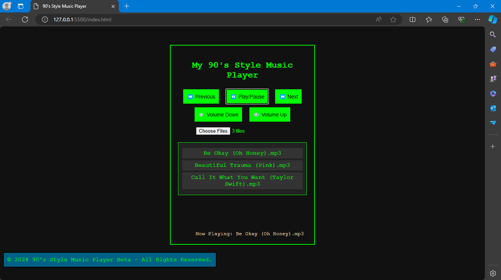

# Music Player with 90's Style UI

## Introduction

This is a basic 90's Style music player. It is still in the development stage, with a very simple and basic user interface. The design is inspired by the music players from the 1990s, featuring a minimalist and retro look.

## Features:

- **Playlists**: You can load multiple music files via the file input, and the songs will be displayed in a playlist that users can click to play.
- **Now Playing Display**: Shows the name of the song currently playing.
- **Music Controls**: Includes buttons for play/pause, previous, next, volume up, and volume down.
- **90's Style UI**: The look and feel are created using basic HTML/CSS to match old-school aesthetics, with green text on a dark background, simple controls, and a minimalist design.

## How it Works:

- **Playlist**: Upload multiple audio files, and they will be listed in the playlist. You can click any song in the list to start playing.
- **Music Player**: Use the play, pause, next, and previous buttons to control playback.
- **Volume Controls**: Use the buttons to increase or decrease the volume.
- **Automatic Next**: When one song finishes, the next song in the playlist will automatically start playing.

## How to Use:

1. Copy the code of `index.html` and `main.js` into `.html` and `.js` files, respectively.
2. Open the HTML file in a browser.
3. Use the `Choose File` button to load audio files from your computer, and then control playback using the buttons.

Feel free to explore, provide feedback, or contribute to its development. 🎶

